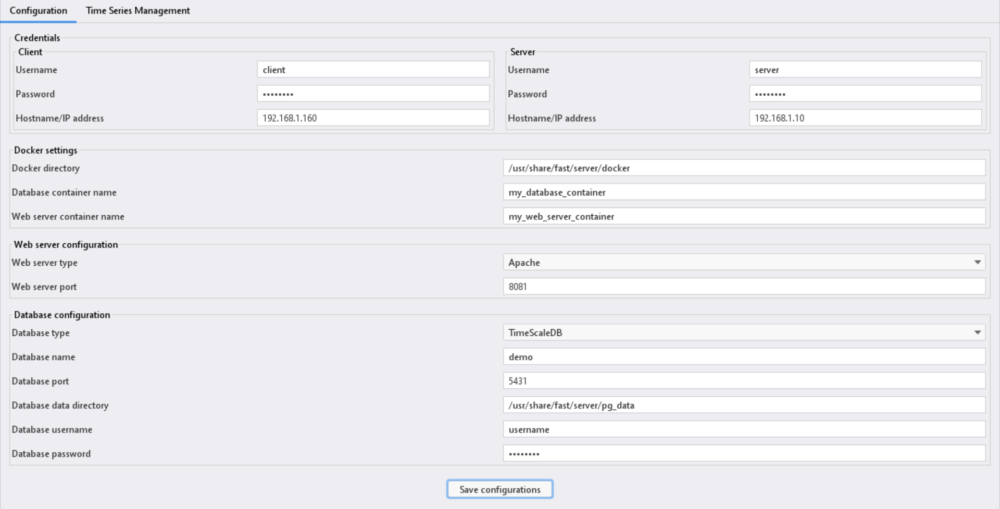
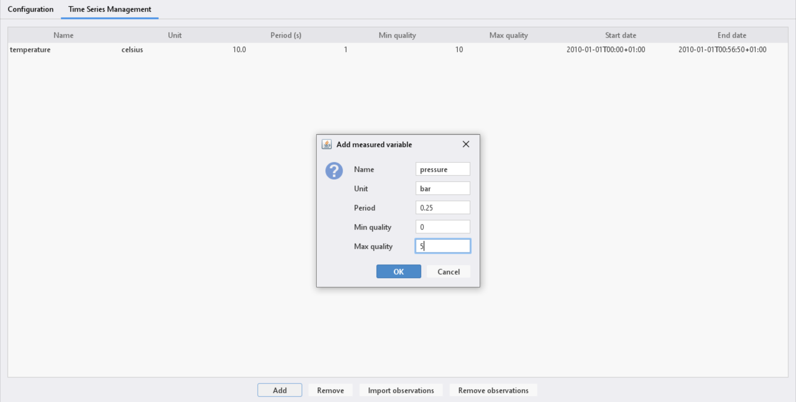
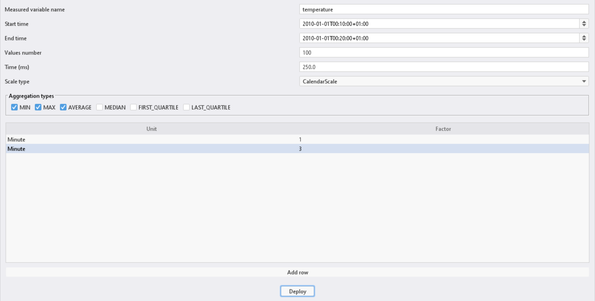

# FaST - An Efficient Framework For Visualizing Large-Scale Time Series

FaST is a model-driven framework that queries large-scale time series data deployed on a client-server architecture.

## Citation

If you use FaST in your research or projects, please cite:

> Manele Ait Habouche, Mickaël Kerboeuf, Goulven Guillou and Jean-Philippe Babau. FaST: An Efficient Framework For Visualizing Large-Scale Time Series. 2022 IEEE International Conference On Big Data (Big Data), 3745–3754. DOI: [10.1109/BigData55660.2022.10020317](https://doi.org/10.1109/BigData55660.2022.10020317).

---

## Project structure

FaST is organized into three main directories:

- **/api** - Provides the main libraries that configure and manage time series data within the FaST framework (e.g., `fr.ubo.fast.common`, `fr.ubo.fast.client`, etc.).
- **/modeling** - Contains the Ecore metamodel, Domain-Specific Language (DSL) definitions, and Acceleo templates for generating FaST configurations.  
- **/server** - Provides deployment scripts, Docker configurations, and other server‐side setup files.

---

## Requirements

### Server tested environment

- Ubuntu 18.04
- Java Runtime Environment (JRE) 8

### Client tested environment

- Windows 10
- Java Runtime Environment (JRE) 8
- Maven
- OpenSSH Server
- PuTTY

---

## Building packages

1. Import or copy the `api` folder from the Git repository into a local directory on your client. For instance: `C:/Users/Username/FaST/api`.

2. Inside the `api` folder, you will find several Maven modules. Build them in the following order, using the `mvn clean install` command.
   - **`fr.ubo.fast.common`**  
   - **`fr.ubo.fast.client`**  
   - **`fr.ubo.fast.performance`**  
   - **`fr.ubo.fast.data.manager`**  
   - **`fr.ubo.fast.configuration.client`**  
   - **`fr.ubo.fast.configuration.server`**  
   - **`fr.ubo.fast.gui`**  

   For instance:

   ```bash
   cd C:/Users/Username/FaST/api/fr.ubo.fast.common
   mvn clean install

   cd ../fr.ubo.fast.client
   mvn clean install

   # And so on for each module in the order listed above
   ```

> **Note:** After building, each module’s `target` directory will contain its generated artifacts (JARs, WARs, or configuration files) that are used in later deployment steps.

---

## Server and client configuration and deployment 

### Client-side

1. Navigate to the folder containing the generated administration JAR file.
```bash
cd C:/Users/Username/FaST/api/fr.ubo.fast.gui/target
```

2. To configure the platform, launch the following JAR file: `fr.ubo.fast.gui-0.0.1-SNAPSHOT-administration-jar-with-dependencies`.

3. In the **Configuration** tab of the GUI, edit the platform properties as needed then click on the **Save configurations** button. This will generate four folders:
   - `docker`  
   - `time_scale_db`  
   - `client`  
   - `web_server`  

   Example:
   

### Server-side

1. Import or copy the `server` folder from the Git repository into a local directory on your server. For instance: `/usr/share/fast/server`.

2. Copy the four configuration folders generated on the client side (`docker`, `time_scale_db`, `client`, `web_server`) into the server’s configuration folder `/usr/share/fast/server/conf`.

3. Copy the built Data Manager application folder `fr.ubo.fast.data.manager/target/fr.ubo.fast.data.manager` into `/usr/share/fast/server/docker/apache`.
  
4. Run the installation script to deploy the Docker containers and start the Data Manager service.
   ```bash
   cd /usr/share/fast/server
   sudo ./install.sh
   ```
   This script will install the necessary Docker containers (Apache/Tomcat and TimescaleDB), apply the configuration files, and launch the services. Once completed, Apache and TimescaleDB should be running with the Data Manager deployed.

---

## Database administration

1. Navigate to the folder containing the generated administration JAR file.
```bash
cd C:/Users/Username/FaST/api/fr.ubo.fast.gui/target
```

2. To manage and populate the time series database, launch the following JAR file: `fr.ubo.fast.gui-0.0.1-SNAPSHOT-administration-jar-with-dependencies`.

3. In the GUI, switch to the **Time Series Management** tab. Here, you can add meta-data for a new time series as illustrated below.



4. To import observations, use CSV files formatted with the following columns (exact order is required): **time**,**value**,**quality**.

   Example of a valid CSV file:
   ```
   time,value,quality
   2010-01-01T00:00:00+01:00,25.36,1
   2010-01-01T00:00:10+01:00,21.81,1
   2010-01-01T00:00:20+01:00,29.59,1
   ```

   > Ensure that the period field in the meta-data of your time series matches the actual sampling rate of the observations in the CSV file. This alignment is not automatically handled by FaST.

5. Additionally, the GUI allows you to:
   - Remove a time series (including all its associated observations and configurations).
   - Remove specific observations within a defined time range.

---

## Database configuration

1. Navigate to the folder containing the generated GUI configuration JAR file.
```bash
cd C:/Users/Username/FaST/api/fr.ubo.fast.gui/target
```

2. To configure data aggregation for efficient time series navigation, launch the following JAR file: `fr.ubo.fast.gui-0.0.1-SNAPSHOT-configuration-jar-with-dependencies`.

3. In the GUI, define the aggregation parameters such as time intervals, aggregation types, and scale settings. Click on the **Deploy** button to apply the configuration and create the necessary tables in the database.

   Example: 
   